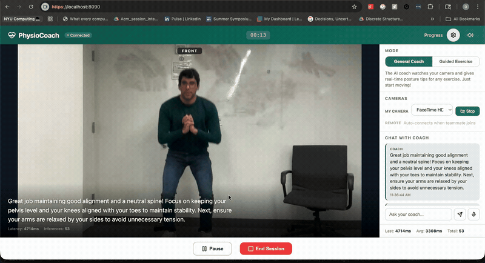

# PhysioCoach 🏋️

[](https://github.com/deepanshumody/physiocoach/actions/workflows/tests.yml)
[](https://www.python.org/)
[](LICENSE)

**Real-time AI physical therapy coaching powered by Vision Language Models and MediaPipe — fully local, no cloud required.**

PhysioCoach watches you exercise through your webcam, analyzes your form using a local VLM, counts your reps using pose estimation, and speaks coaching cues aloud in real time. Everything runs on-device.

Built at the **Dell × NVIDIA Hackathon 2026** by NYU students. Reached **Top-8** out of 30 teams from NYU CDS.

## Demo



---

## Built on NVIDIA's Live VLM WebUI

PhysioCoach is built on top of NVIDIA's open-source **[Live VLM WebUI](https://github.com/nvidia-ai-iot/live-vlm-webui)** (Apache-2.0). That project provides the foundation we started from:

- the **WebRTC + WebSocket streaming server** (`server.py`),
- the **OpenAI-compatible VLM client** (`vlm_service.py`),
- **GPU/system monitoring** (`gpu_monitor.py`) and **RTSP camera support** (`rtsp_track.py`).

On top of that base, our team built the **physical-therapy layer** that makes PhysioCoach: pose-based rep counting, range-of-motion measurement, the exercise library, the coaching/feedback pipeline, and the dual-camera mode. See [What We Built](#what-we-built) for the file-level breakdown, and [`NOTICE`](NOTICE) for attribution details. NVIDIA copyright headers and the Apache-2.0 `LICENSE` are retained throughout.

---

## What It Does

- 📷 **Streams your webcam** via WebRTC at 30fps from any browser
- 🤖 **Analyzes your form** using Qwen2.5-VL-7B running locally (~800ms per frame)
- 🦴 **Counts your reps** by tracking joint angles with MediaPipe Pose
- 🔊 **Speaks coaching cues** aloud via browser Text-to-Speech
- 📐 **Estimates ROM** (range-of-motion) joint angles to track progress
- 📷 **Supports dual cameras** — front and side view simultaneously

---

## What We Built

The modules below are PhysioCoach's original contribution — the physical-therapy layer on top of NVIDIA's streaming base:

| Module | What it does | Origin |
|---|---|---|
| `pose_detector.py` | MediaPipe Pose wrapper: 33 landmarks → joint angles → rep-counting state machine, ROM angles, skeleton overlay | **Ours** |
| `exercise_library.py` | 15 exercise definitions: joint triplets, rep thresholds, ROM targets, and per-exercise VLM prompt templates | **Ours** |
| `session_manager.py` | Session persistence (SQLite), rep-count state, progress tracking | **Ours** |
| `video_processor.py` | Per-frame pipeline running the VLM coaching and MediaPipe pose/ROM paths **in parallel** | Heavily modified |
| `vlm_service.py` | Structured PT-coaching prompts + JSON feedback parsing | Modified |
| `static/index.html` | PhysioCoach browser UI: exercise picker, live ROM cards, rep counter, dual-camera grid, TTS | **Ours** |
| `server.py`, `gpu_monitor.py`, `rtsp_track.py` | WebRTC/VLM server, monitoring, RTSP | NVIDIA (inherited) |

---

## Supported Exercises

| Category | Exercises |
|---|---|
| **Lower body** | Bodyweight Squat, Forward Lunge, Calf Raise, Seated Knee Extension, Side-Lying Leg Raise, Standing Hip Abduction, Seated Tennis Ball Squeeze |
| **Upper body** | Wall Push-Up, Shoulder Raise, Bicep Curl, Hand Tennis Ball Squeeze, Wall Slide with Towel, Seated Water Bottle Overhead Press |
| **Stretch** | Neck Rotation |
| **General** | Auto-detect mode — the AI identifies the exercise automatically |

All exercises are defined in `exercise_library.py`.

---

## How It Works

```
Webcam (30fps)
    │
    ▼
WebRTC stream → server.py → video_processor.py
    │
    ├──► Every 15 frames (coaching mode) → Qwen2.5-VL-7B (local)
    │         └── JSON coaching cue → natural-language feedback → TTS spoken aloud
    │
    └──► Every 3rd frame → MediaPipe Pose
              └── 33 landmarks → joint angle → threshold crossing → rep count + ROM
```

The VLM and MediaPipe run **in parallel** — pose tracking never waits for VLM inference. Pose detection is cheap (~5–15ms on CPU) and runs continuously; the heavier VLM call is throttled to every 15th frame in coaching mode.

---

## Architecture

```
src/live_vlm_webui/
├── server.py            # WebRTC + WebSocket server (aiohttp + aiortc)   [NVIDIA base]
├── video_processor.py   # Per-frame pipeline: VLM calls + pose, in parallel
├── vlm_service.py        # OpenAI-compatible VLM API client
├── pose_detector.py     # MediaPipe Pose: landmarks, joint angles, rep counter, ROM, skeleton overlay
├── exercise_library.py  # Exercise definitions, joint configs, ROM targets, VLM prompt templates
├── session_manager.py   # Session persistence + rep-counting state
├── gpu_monitor.py       # GPU/CPU/RAM monitoring                          [NVIDIA base]
├── rtsp_track.py        # RTSP / IP-camera video track                    [NVIDIA base]
└── static/index.html    # Browser frontend (exercise UI, ROM cards, TTS)
```

> Note: the internal Python import package is still named `live_vlm_webui` (kept to preserve the upstream module paths and git history). The installable distribution is named `physiocoach`.

---

## How Rep Counting Works

MediaPipe Pose detects 33 body landmarks. For each exercise, a specific 3-joint triplet is tracked and the angle is measured at the middle joint:

| Exercise | Joint triplet (angle at middle joint) | Down threshold | Up threshold |
|---|---|---|---|
| Bodyweight Squat | hip → knee → ankle | 100° | 155° |
| Bicep Curl | shoulder → elbow → wrist | 50° | 140° |
| Calf Raise | hip → knee → ankle | 160° | 172° |
| Shoulder Raise | hip → shoulder → wrist | 30° | 70° |

A rep is counted when the tracked angle passes through both thresholds, completing one full movement cycle. Each exercise has its own joint config and thresholds defined in `exercise_library.py`.

For shoulder and elbow exercises, the active arm is auto-detected each frame by comparing which wrist is raised or which elbow is more bent. Some exercises (e.g. **Neck Rotation**, **Tennis Ball Squeeze**) are tracked by ROM angle or VLM feedback rather than threshold-based rep counting.

---

## Model Selection

We tested four models before choosing Qwen2.5-VL-7B:

| Model | Latency | Result |
|---|---|---|
| `llama3.2-vision:11b` | 4–8s | Too slow for real-time |
| `llama3.2-vision:90b` | 60s+ | OOM |
| `qwen2.5vl:32b` | — | OOM |
| `qwen2.5vl:7b` | ~800ms | ✅ Used |

The prompt went through three iterations — the final version removes all fallback phrases so the model always comments on what it actually sees.

---

## Setup

### Requirements

- Python 3.10+
- [Ollama](https://ollama.ai) with `qwen2.5vl:7b` pulled
- A webcam accessible from your browser

### Install

```bash
git clone https://github.com/deepanshumody/physiocoach.git
cd physiocoach

python3 -m venv .venv
source .venv/bin/activate

pip install -e .
```

### Pull the model

```bash
ollama pull qwen2.5vl:7b
ollama serve
```

### Run

```bash
./scripts/start_server.sh
```

Open **`https://localhost:8090`** in your browser. Accept the self-signed certificate warning (Advanced → Proceed), then grant camera access.

---

## Usage

1. **Select an exercise** from the dropdown (or leave on General for auto-detection)
2. **Click Start** — the AI begins analyzing your form every ~15 frames
3. **Listen to coaching cues** — spoken aloud via your browser
4. **Watch the rep counter** — increments automatically as you move
5. **Check ROM angles** — displayed live on the video overlay

### Dual Camera Mode

For exercises where front and side views both matter:

1. Connect a second webcam (or use a phone as a second camera)
2. Enable **Dual Camera** in the UI
3. The AI receives both feeds and gives form feedback with full 3D context

---

## Dependencies

| Package | Purpose |
|---|---|
| `aiortc` | WebRTC implementation |
| `aiohttp` | Async HTTP + WebSocket server |
| `mediapipe` | Pose landmark detection |
| `opencv-python` | Frame processing, skeleton overlay |
| `openai` | OpenAI-compatible VLM API client |
| `nvidia-ml-py` / `psutil` | GPU + system monitoring |

---

## Team & Contributions

Built by **Deepanshu Mody, Anagha Palandye, Taruni Nugooru** — NYU Center for Data Science — at the Dell × NVIDIA Hackathon, February 2026.

- **Deepanshu Mody** — Pose-based rep-counting engine (MediaPipe → joint-angle state machine), the exercise library and auto-detect coaching mode, VLM coaching-prompt engineering, the dual-camera WebRTC pipeline, and overall project integration.
- **Taruni Nugooru** — Range-of-motion (ROM) angle measurement and its on-video / sidebar display, the skeleton overlay, and dual-camera UI.
- **Anagha Palandye** — Exercise research and clinical form criteria, testing, and demo.
